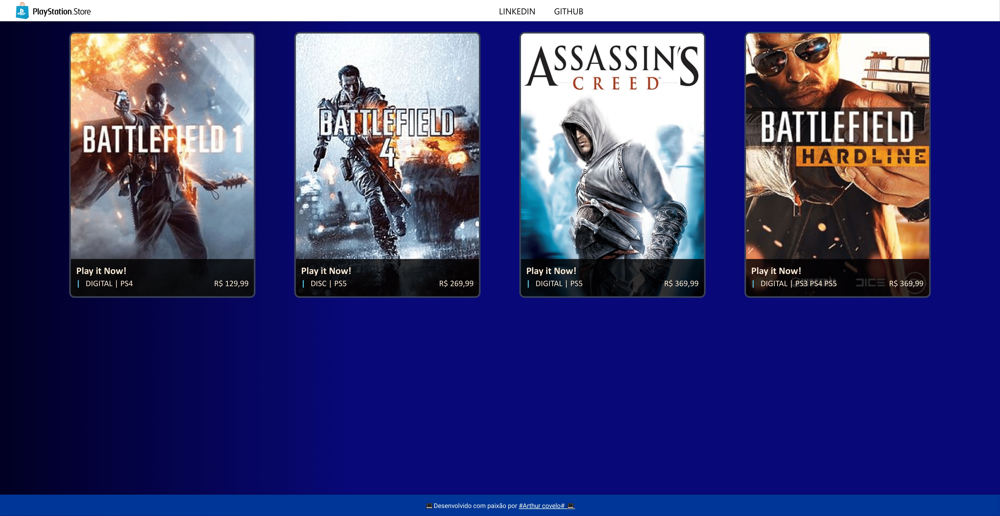

## 📚 Sobre o projeto 
Este projeto foi desenvolvido como parte do Curso Formação Angular no dio, com o objetivo de aplicar os conhecimentos adquiridos no framework Angular. 
Angular 17.1.1
 

## 🖥️ Tecnologias utilizadas

---
 

  
  
       

